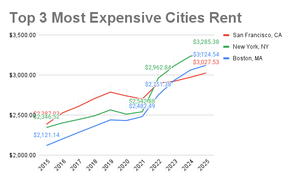

# excel_projects
Keeping track of different Excel projects, mostly dealing with real estate data

This project examines average rent price data from Zillow

### Data Cleaning:
Raw data from Zillow provides average rent by month. This data is more useful organized by year. The INDEX MATCH function uses the name of the city to locate the matching row of data. The FILTER function returns only the data with a YEAR found in the designated column (2015, 2016...). The AVERAGE function takes the average of the monthly rent data returned by the FILTER function. IFERROR reutrns NA if the AVERAGE function throws an error because there are no values to average (when all months of a year are blank).

=IFERROR(AVERAGE(FILTER(INDEX(Data_Backup!$F$3:$DX$650, MATCH($C4, Data_Backup!$C$3:$C$650,0)), YEAR(Data_Backup!$F$1:$DX$1) = D$3)),NA())

|   City Name    |	  2015   |	  2016   |	  2017   |	  2018   |	 2019   |
|----------------|-----------|-----------|-----------|-----------|----------|
|New York, NY    |	2,346.52 |	2,403.87 |	2,445.80 |	2,491.73 |	2,566.24|
|Los Angeles, CA |	1,876.55 |	1,992.62 |	2,109.63 |	2,210.35 |	2,299.63|
|Chicago, IL     |	1,462.31 |	1,504.06 |	1,542.35 |	1,579.26 |	1,623.74|
|Dallas, TX      |	1,146.86 |	1,203.76 |	1,263.34 |	1,311.41 |	1,361.33|
|Houston, TX	   | 1,241.36  |	1,252.25 |	1,270.79 |	1,317.79 |	1,341.26|

|   City Name       | 	  2015   |	  2016   |	  2017   |	  2018   |	 2019   |
|-------------------|------------|-----------|-----------|-----------|----------|
|Hickory, NC	      |   #N/A     |	#N/A	   |#N/A       |	#N/A	   |   #N/A   |
|Huntington, WV     |	#N/A	     |  754.78	 |   777.55  |	792.65   |	813.92  |
|Fort Collins, CO	  |  1,278.02  |	1,328.05 |	1,371.93 |	1,425.33 |	1,478.82|
|Rockford, IL	      |  706.70    |	730.22   |	754.31   |	781.80   |	817.80  |
|Lincoln, NE        |	#N/A	     |  866.49   |	891.25   |	923.56   |	947.06  |

**Insights**
1. San Francisco started as the highest of the three most expensive cities in 2015, but by 2025 had been surpassed by both New York and Boston.
2. Rents in New York jumped more than 16.5% between 2021 and 2022 to $2,963, surpassing SF for the first time. It was the largest annual increase of the three cities from 2015 to 2025.
3. Average rent in Boston increased 47% between 2015 and 2025. NY rent rose 40%, and SF rent rose 27%.
